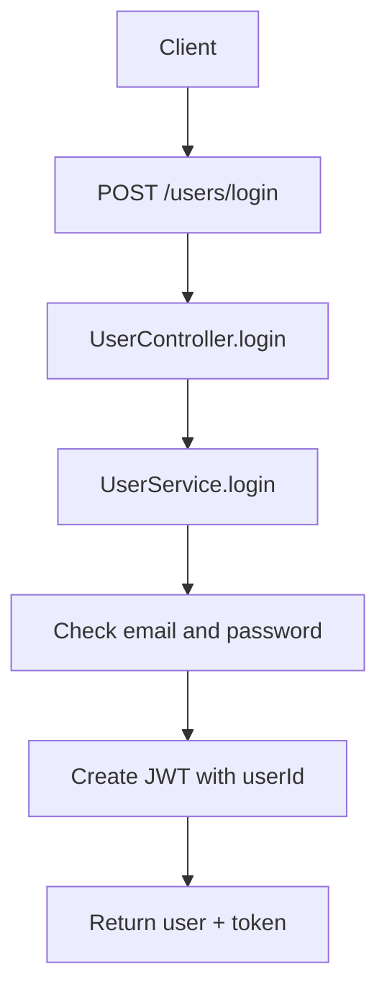
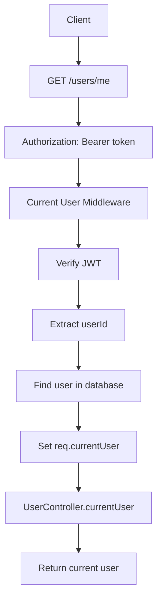
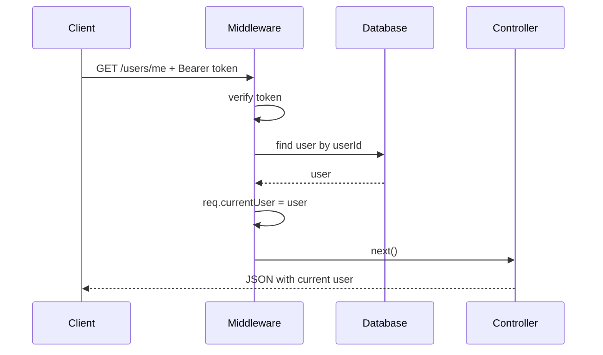
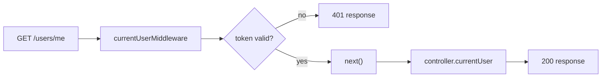
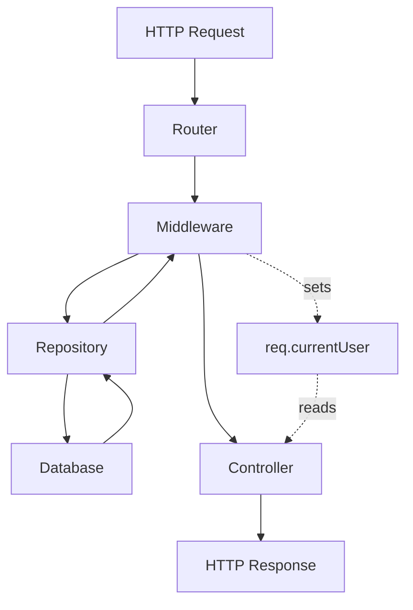

# Материал для объяснения темы: Current User Middleware

## 1. Что было до этой темы

До этой лабораторной работы в проекте уже была базовая авторизация:

1. Пользователь мог зарегистрироваться через `POST /users/register`.
2. Пользователь мог залогиниться через `POST /users/login`.
3. При успешном login сервер выдавал JWT-токен.
4. Внутри JWT-токена сохранялся `userId`.

Пример ответа после login:

```json
{
  "user": {
    "id": "cfbf5c7b-593b-4145-869c-cea879575164",
    "email": "student@example.com",
    "createdAt": "2026-05-20T10:30:55.594Z"
  },
  "token": "jwt-token"
}
```

То есть сервер уже умел сказать: "Да, email и password правильные, вот твой token".

Но на этом месте была важная незавершённость.

Сервер выдавал токен, но у нас ещё не было нормального механизма, который на следующих запросах мог бы:

1. Принять этот token обратно.
2. Проверить его.
3. Понять, какой пользователь делает запрос.
4. Передать этого пользователя дальше в controller.

До этой темы token был как пропуск, который уже выдали, но охранник на следующей двери ещё не умел его читать.

## 2. Какая проблема появилась

Представим, что frontend хочет открыть страницу профиля:

```http
GET /users/me
```

Вопрос: как backend поймёт, чей профиль нужно вернуть?

Варианты, которые делать не стоит:

1. Передавать email в body.
2. Передавать user id руками в URL.
3. Каждый раз заново отправлять password.

Плохой пример:

```http
GET /users/me?id=some-user-id
```

Почему это плохо:

1. Клиент может подставить чужой `id`.
2. Сервер начнёт доверять данным, которые пришли от клиента.
3. Это легко превращается в уязвимость.

Правильная идея:

1. После login клиент получает JWT.
2. Клиент отправляет JWT в защищённых запросах.
3. Сервер сам достаёт `userId` из проверенного токена.
4. Сервер сам находит пользователя в базе.

## 3. Что теперь добавляем

В этой теме мы добавляем Current User Middleware.

Middleware - это функция, которая выполняется между запросом клиента и controller.

Она может:

1. Проверить данные запроса.
2. Добавить что-то в `req`.
3. Остановить запрос с ошибкой.
4. Передать запрос дальше через `next()`.

Current User Middleware делает конкретную работу:

1. Читает заголовок `Authorization`.
2. Проверяет, что токен передан в формате `Bearer token`.
3. Проверяет JWT.
4. Достаёт из JWT `userId`.
5. Ищет пользователя в базе.
6. Кладёт пользователя в `req.currentUser`.
7. Вызывает `next()`.

После этого controller может просто использовать:

```ts
req.currentUser
```

## 4. Схема: что было раньше



Раньше цепочка заканчивалась выдачей токена.

Сервер говорил:

```text
Вот token. Сохрани его на клиенте.
```

Но ещё не было отдельного protected endpoint, который использует этот token.

## 5. Схема: что стало теперь



Теперь token используется не только как результат login, но и как способ доказать серверу, кто делает запрос.

## 6. Как выглядит запрос

Клиент отправляет:

```http
GET /users/me
Authorization: Bearer jwt-token
```

Здесь важно слово `Bearer`.

Полный заголовок состоит из двух частей:

```text
Bearer jwt-token
```

1. `Bearer` - схема авторизации.
2. `jwt-token` - сам токен.

В коде мы разбираем это так:

```ts
const [scheme, token] = authHeader.split(" ");
```

Если клиент отправит просто:

```http
Authorization: qwerty
```

сервер вернёт:

```json
{
  "error": "Bearer token required"
}
```

## 7. Что лежит внутри JWT

При login мы создаём токен:

```ts
const token = signedToken({ userId: user.id });
```

Это значит, что payload токена содержит `userId`.

Упрощённо JWT можно представить так:

```text
JWT
├── header
├── payload
│   └── userId
└── signature
```

Сервер проверяет подпись токена. Если подпись правильная, сервер доверяет payload и может взять оттуда `userId`.

Важно: мы не кладём в токен password.

## 8. Почему недостаточно просто достать userId из токена

Можно спросить: если в токене уже есть `userId`, зачем идти в базу?

Причины:

1. Пользователь мог быть удалён.
2. Пользователь мог быть заблокирован.
3. Данные пользователя могли измениться.
4. Нам нужен актуальный объект пользователя.
5. Мы хотим убедиться, что такой пользователь всё ещё существует.

Поэтому middleware делает:

```ts
const user = await repo.findById(userId);
```

Если пользователя нет:

```ts
return res.status(401).json({ error: "User from token not found" });
```

## 9. Почему нужен `req.currentUser`

`req` - это объект текущего HTTP-запроса.

Если middleware положит пользователя в `req.currentUser`, следующий controller сможет его прочитать.

Схема:



Главный смысл:

```ts
req.currentUser = toUserResponse(user);
```

После этой строки controller уже не думает о JWT.

Он просто работает с текущим пользователем.

## 10. Почему используем `toUserResponse`

Из базы пользователь приходит примерно в таком виде:

```ts
{
  id: "...",
  email: "student@example.com",
  password: "hashed-password",
  createdAt: Date
}
```

Но клиенту нельзя отдавать password, даже если это hash.

Поэтому есть mapper:

```ts
toUserResponse(user)
```

Он превращает database entity в безопасный DTO:

```ts
{
  id: user.id,
  email: user.email,
  createdAt: user.createdAt.toISOString(),
}
```

Именно этот безопасный объект мы кладём в `req.currentUser`.

## 11. Почему нужно расширять тип Request

В JavaScript можно написать:

```ts
req.currentUser = user;
```

Но TypeScript скажет:

```text
Property 'currentUser' does not exist on type Request
```

Потому что стандартный Express Request не знает такого поля.

Поэтому мы добавляем файл:

```text
src/types/express.ts
```

И описываем новое поле:

```ts
declare global {
  namespace Express {
    interface Request {
      currentUser?: UserResponseDto;
    }
  }
}
```

Теперь TypeScript понимает, что у `req` может быть `currentUser`.

Почему поле необязательное:

```ts
currentUser?: UserResponseDto;
```

Потому что не все endpoints защищённые.

Например:

1. `POST /users/register` - без текущего пользователя.
2. `POST /users/login` - без текущего пользователя.
3. `GET /users/me` - с текущим пользователем.

## 12. Почему middleware создаётся через функцию

Обычно Express middleware выглядит так:

```ts
function middleware(req, res, next) {}
```

У нас middleware создаётся так:

```ts
createCurrentUserMiddleware(repo)
```

Почему?

Потому что middleware нужен доступ к базе данных через repository.

Мы не создаём repository прямо внутри middleware. Вместо этого мы передаём его снаружи:

```ts
router.get("/me", createCurrentUserMiddleware(repo), controller.currentUser);
```

Такой подход называется dependency injection.

Простое объяснение:

```text
Не создаём зависимость внутри.
Передаём зависимость снаружи.
```

Это делает код более гибким и лучше подходит к структуре проекта.

## 13. Как Express выполняет route

Route:

```ts
router.get("/me", createCurrentUserMiddleware(repo), controller.currentUser);
```

Express выполняет обработчики слева направо.



Если middleware не вызовет `next()`, controller не выполнится.

Если middleware вернёт `401`, controller тоже не выполнится.

## 14. Что происходит при ошибках

### Нет заголовка Authorization

Запрос:

```bash
curl http://localhost:3000/users/me
```

Ответ:

```json
{
  "error": "Authorization header required"
}
```

Смысл: клиент вообще не отправил токен.

### Неправильный формат

Запрос:

```bash
curl http://localhost:3000/users/me \
  -H "Authorization: qwerty"
```

Ответ:

```json
{
  "error": "Bearer token required"
}
```

Смысл: заголовок есть, но он не в формате `Bearer token`.

### Неправильный токен

Запрос:

```bash
curl http://localhost:3000/users/me \
  -H "Authorization: Bearer wrong-token"
```

Ответ:

```json
{
  "error": "Invalid or expired token"
}
```

Смысл: токен не прошёл JWT-проверку.

### Правильный токен

Запрос:

```bash
curl http://localhost:3000/users/me \
  -H "Authorization: Bearer jwt-token"
```

Ответ:

```json
{
  "user": {
    "id": "user-id",
    "email": "student@example.com",
    "createdAt": "2026-05-20T08:00:00.000Z"
  }
}
```

Смысл: middleware успешно определил текущего пользователя.

## 15. Как это объяснить коротко

Можно объяснить так:

До этого у нас был login, который выдавал token.

Теперь мы научили сервер использовать этот token.

Когда клиент приходит на защищённый endpoint, он отправляет:

```http
Authorization: Bearer token
```

Middleware проверяет token, достаёт `userId`, находит пользователя в базе и записывает его в:

```ts
req.currentUser
```

После этого controller может вернуть текущего пользователя без повторной логики авторизации.

## 16. Главная мысль темы

Current User Middleware нужен для того, чтобы отделить авторизацию от бизнес-логики controller.

Controller не должен знать:

1. Как устроен JWT.
2. Где лежит token.
3. Как проверить подпись.
4. Как достать `userId`.

Controller должен получить уже готовый результат:

```ts
req.currentUser
```

Это делает код чище:

```text
Middleware отвечает за авторизацию.
Controller отвечает за HTTP-ответ.
Service отвечает за бизнес-логику.
Repository отвечает за базу данных.
```

## 17. Итоговая схема архитектуры



## 18. Можно проговорить в конце занятия

После этой лабораторной студенты должны понимать:

1. JWT нужен не только для login, но и для следующих защищённых запросов.
2. `Authorization: Bearer token` - стандартный способ передавать access token.
3. Middleware может остановить запрос или передать его дальше.
4. `next()` запускает следующий обработчик.
5. `req.currentUser` - это удобное место для текущего пользователя.
6. TypeScript нужно явно научить новому полю в `Request`.
7. Пароль нельзя передавать дальше, даже внутри `req.currentUser`.
8. Controller становится проще, если auth-логику вынести в middleware.
